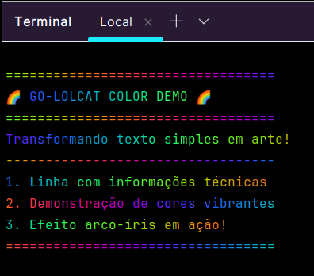

# 🌈 go-lolcat

[](https://go.dev/)
[](LICENSE)


Um coloridor de texto dinâmico implementado em Go que transforma saídas do terminal em um visual de arco-íris! 🎨



## 🎯 Sobre o Projeto

Este projeto foi desenvolvido como parte do meu aprendizado em Go, focando em:
- Manipulação de entrada/saída de terminal
- Processamento de texto em tempo real
- Uso de pipes e streams em Go
- Matemática aplicada para geração de cores (funções trigonométricas)

## ✨ Funcionalidades

- 🌈 **Coloração Dinâmica**: Utiliza funções trigonométricas para gerar um gradiente de cores suave
- 📊 **Processamento em Tempo Real**: Processa e colore cada caractere instantaneamente
- 🔄 **Suporte a Pipe**: Integração perfeita com outros comandos Unix através de pipes
- 🚀 **Alta Performance**: Processamento eficiente sem armazenamento em buffer
- 💻 **Cross-Platform**: Funciona em Windows, Linux e macOS

## 🛠️ Tecnologias Utilizadas

- **Go 1.21+**: Aproveitando as mais recentes funcionalidades da linguagem
- **Packages nativos**:
    - `bufio`: Leitura eficiente da entrada
    - `math`: Cálculos para geração de cores
    - `fmt`: Formatação e saída
    - `os`: Interação com sistema operacional

## 📋 Pré-requisitos

- Go 1.21 ou superior


## 💻 Como Usar

1. **Clone o repositório**
```bash
git clone https://github.com/IsisAraujo/Go-Lolcat.git
cd Go-Lolcat
```

2. **Execute com texto simples**
```bash
echo "Hello, Colorful World!" | go run main.go
```

3**Combine com outros comandos**
```bash
ls -l | go run main.go
```

## 🔍 Código em Destaque

O coração do projeto está na função que gera as cores RGB usando matemática:
```go
func rgb(i int) (int, int, int) {
    var f = 0.1
    return int(math.Sin(f*float64(i)+0)*127 + 128),
        int(math.Sin(f*float64(i)+2*math.Pi/3)*127 + 128),
        int(math.Sin(f*float64(i)+4*math.Pi/3)*127 + 128)
}
```

## 📬 Contato

Isis Araujo - [LinkedIn](https://www.linkedin.com/in/isisaraujo/) 

---